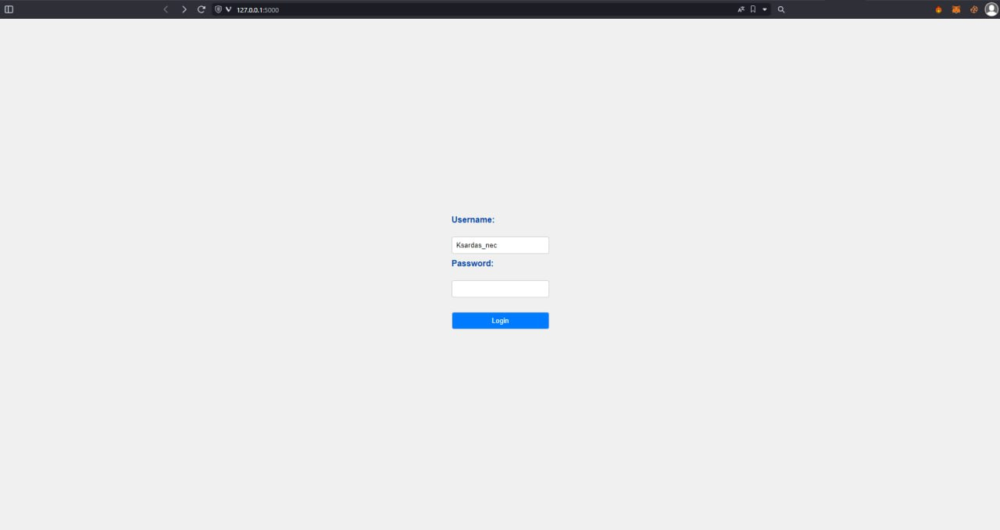
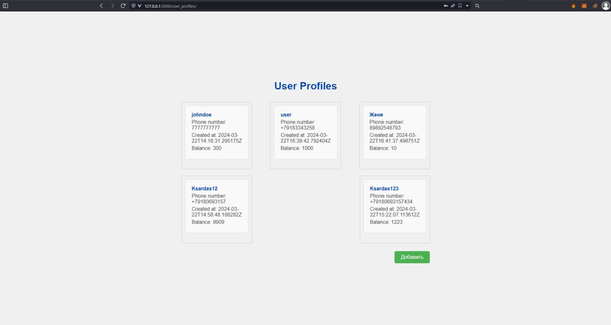
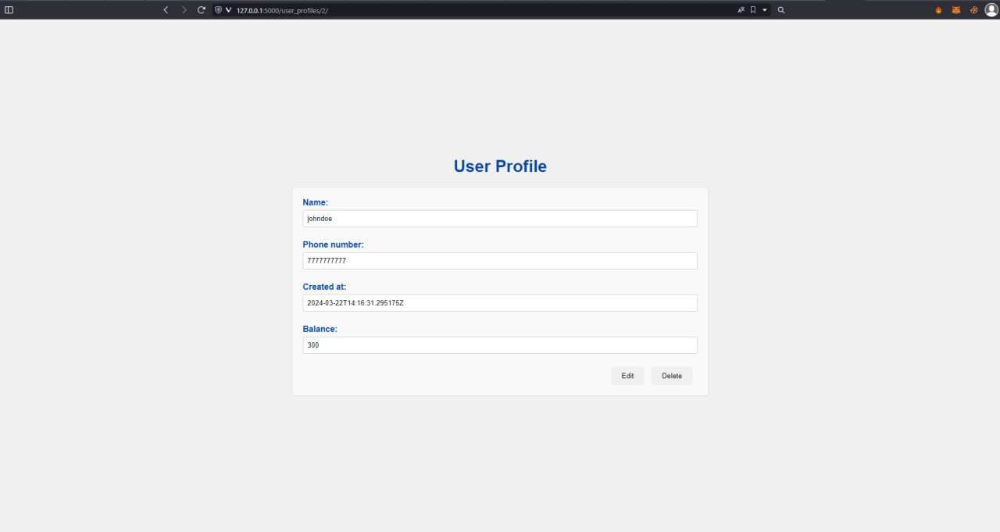
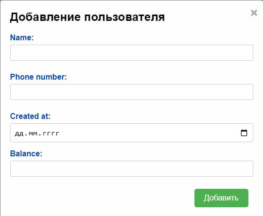

  
  <h1>
  Админская часть
  
  </h1>

---

# :hammer_and_wrench: Языки и инструменты :

  
  

# Содержание

  - [Элементы GUI](#элементы-gui)
      - [Авторизация](#авторизация)
      - [Список пользователей](#список-пользователей)
      - [Просмотр пользователя](#просмотр-пользователя)
      - [Добавление пользователя](#добавление-пользователя)

### Авторизация

### Список пользователей

### Просмотр пользователя

### Добавление пользователя

